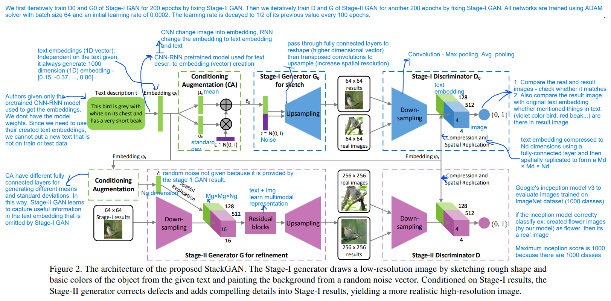

# Reproduce and Enhance StackGAN-pytorch
- Run [Reproduce stackGAN file](Reproduce/Reproduce_stackGAN.ipynb) (Run all)
- `pip install` the following packages that is included in [Reproduce stackGAN file](Reproduce/Reproduce_stackGAN.ipynb):
  - `tensorboard`
  - `python-dateutil`
  - `easydict`
  - `pandas`
  - `torchfile`
  - `tensorboardx`
- changed python version - 2.7 to 3.10
- changed torch version - 0.4 to 2.0
- birds metadata from: https://drive.google.com/file/d/1O_LtUP9sch09QH3s_EBAgLEctBQ5JBSJ/view and add it to `../data/`
- birds image data from: https://data.caltech.edu/records/65de6-vp158/files/CUB_200_2011.tgz?download=1 and add it to `../data/birds/`
- char-CNN-RNN text embeddings for birds from : https://drive.google.com/file/d/0B3y_msrWZaXLT1BZdVdycDY5TEE/view?resourcekey=0-sZrhftoEfdvHq6MweAeCjA and extract it and get char-CNN-RNN-embeddings.pickle, add it to `../data/birds/train/`


## Enhancing text-to-image synthesis using data-centric approaches with StackGAN 
### Data-centric approaches and  process
`Curriculum learning` - dataset is partitioned into easy and hard data using the KEYBERT model. Data with keywords exceeding a certain threshold are categorized as hard data, while the rest are labeled as easy data.

`Coreset selection` - greedy approach is used. Initially, one text embedding is selected, followed by the selection of subsequent embeddings that are distant from the previously chosen one. This process iterates until 10% of the easy data and 50% of the hard data are selected.

`Active learning` - GAN model is trained with 10% of the easy data for 50 epochs. Subsequently, the model predicts on 50% of the hard data. Among the predicted data, instances with higher discriminator loss are selected and appended to the initial 10% data. The GAN model is then retrained with this augmented dataset for 20 epochs. This process repeats until reaching 200 epochs.




**Training**
  - Step 1: train Stage-I GAN (e.g., for 200 epochs) `python main.py --cfg cfg/bird_s1.yml --gpu 0`
  - Step 2: train Stage-II GAN (e.g., for another 200 epochs) `python main.py --cfg cfg/bird_s2.yml --gpu 1`
- `*.yml` files are example configuration files for training/evaluating our models.

<!--**Pretrained Model**
- [StackGAN for coco](https://drive.google.com/open?id=0B3y_msrWZaXLYjNra2ZSSmtVQlE). Download and save it to `models/coco`.
- **Our current implementation has a higher inception score(10.62±0.19) than reported in the StackGAN paper**-->

**[Inception score evaluation](https://github.com/hanzhanggit/StackGAN-inception-model)**

**Evaluating**
- Run `python main.py --cfg cfg/bird_eval.yml --gpu 2` to generate samples from captions in birds validation set.
<!--Examples for COCO:
 


Save your favorite pictures generated by our models since the randomness from noise z and conditioning augmentation makes them creative enough to generate objects with different poses and viewpoints from the same discription :smiley:-->

**References**
```
@inproceedings{han2017stackgan,
Author = {Han Zhang and Tao Xu and Hongsheng Li and Shaoting Zhang and Xiaogang Wang and Xiaolei Huang and Dimitris Metaxas},
Title = {StackGAN: Text to Photo-realistic Image Synthesis with Stacked Generative Adversarial Networks},
Year = {2017},
booktitle = {{ICCV}},
}
```
[StackGAN: Text to Photo-realistic Image Synthesis with Stacked Generative Adversarial Networks](https://arxiv.org/pdf/1612.03242v2.pdf)
